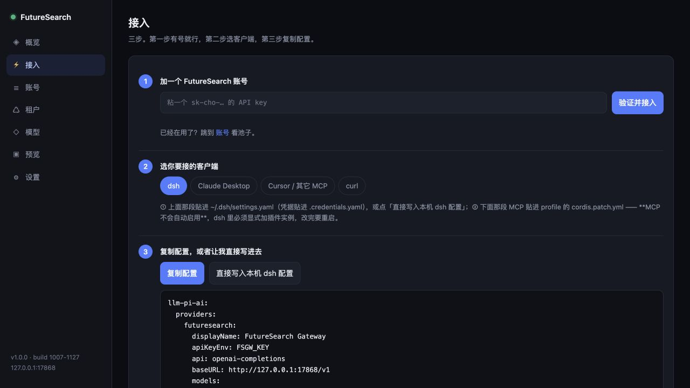

<div align="center">


# FutureSearch Gateway

**Claude、GPT、Gemini……高级模型，一次接齐！**

OpenAI 兼容接口 · 账号与额度管理 · 中文控制台 · 研究与本地文件 MCP

<p>
<a href="https://github.com/hey345437-boop/futuresearch-gateway/actions/workflows/ci.yml"></a>
<a href="go.mod"></a>
<a href="LICENSE"></a>
<a href="https://github.com/hey345437-boop/futuresearch-gateway/releases/latest"></a>
</p>

**中文** · [English](README.en.md)

[快速开始](#quick-start) · [面板预览](#panel) · [连接客户端](#clients) · [模型选择](#models) · [配置说明](#configuration) · [免责声明](#disclaimer)

</div>

---

**143 个上游模型档位、35 个家族入口、7 个研究预设，集中到你自己的 AI 工作台。** 日常问答、深度研究、概率预测，选好模型就能开始；账号、额度和回答风格，也在同一个面板里管理。

FutureSearch 通过“提交任务 → 等待完成 → 读取结果”提供研究能力。这个网关把它转换成 OpenAI Chat Completions 和 MCP 接口，让 DSH、支持 MCP 的 AI 客户端和常用 SDK 都能接入。

**一个程序、一个配置文件、一个数据目录。** 网页控制台已经内置，无需另外安装前端服务。

## 能做什么

| 功能 | 你可以做的事 |
| :--- | :--- |
| **高级模型，一站接入** | Claude、GPT、Gemini、Grok、GLM 等上游模型家族，统一连接常用客户端 |
| **完整目录，自由选档** | 143 个上游模型档位、35 个家族入口，以及 7 个研究/预测预设 |
| **熟悉的聊天接口** | 使用 `/v1/chat/completions` 与 `/v1/models`，支持流式和普通回答 |
| **账号管理** | 添加多个 API Key、查看余额、复用可用账号，遇到异常进入冷却 |
| **租户额度** | 给不同使用者分配 Key，设置额度、并发和允许的档位；额度按网关估算扣减 |
| **回答风格** | 为所有模型或指定模型设置前置指令 |
| **研究工具** | 通过 MCP 调用 10 个工具：`research` / `forecast` / `decision` / `submit_research` / `task_*` / `balance` / `models` |
| **本地项目** | 按需启用文件读取、搜索、写入和命令执行，另有 HTML 预览入口 |

模型名单来自上游接口定义，具体权限和费用由 FutureSearch 决定。网关额度和 token 用量是估算值，不等于平台实际账单。

账号池和租户功能仅适用于上游条款或另行授权允许的场景，详见[免责声明](#disclaimer)。

<a id="quick-start"></a>

## 快速开始

### 方式一：Docker

以下命令适用于 macOS / Linux。先设置自己的**网关访问 Key**和**面板密码**，再启动：

```bash
mkdir -p fsgw-data

docker run -d --name fsgw \
  --user "$(id -u):$(id -g)" \
  -p 127.0.0.1:7868:7868 \
  -v "$PWD/fsgw-data:/data" \
  -e FSGW_LISTEN_HOST=0.0.0.0 \
  -e FSGW_API_KEY=sk-your-client-key \
  -e FSGW_ADMIN_PASSWORD=your-panel-password \
  ghcr.io/hey345437-boop/futuresearch-gateway:latest
```

这个示例将端口发布到本机，并以当前用户身份写入数据目录。镜像支持 `linux/amd64` 和 `linux/arm64`。

打开 **<http://127.0.0.1:7868/>**，用设置的面板密码登录，在「接入」或「账号」页面添加自己的 FutureSearch API Key。

### 方式二：下载程序

到 [Releases](https://github.com/hey345437-boop/futuresearch-gateway/releases/latest) 下载对应系统的程序，放到一个单独的文件夹中运行：

| 系统 | 文件 |
| :--- | :--- |
| Apple 芯片 Mac | `fsgw-darwin-arm64` |
| Intel Mac | `fsgw-darwin-amd64` |
| Linux | `fsgw-linux-amd64` / `fsgw-linux-arm64` |
| Windows | `fsgw-windows-amd64.exe` / `fsgw-windows-arm64.exe` |

例如 Apple 芯片 Mac：

```bash
chmod +x fsgw-darwin-arm64
./fsgw-darwin-arm64
```

默认打开 `127.0.0.1:7868`。首次运行会生成 `config.json`，账号等数据保存在 `data/`；运行版无需安装 Go。

### 方式三：源码启动

需要 **Go 1.24+**，程序仅依赖 Go 标准库。

```bash
git clone https://github.com/hey345437-boop/futuresearch-gateway.git
cd futuresearch-gateway
go build -o fsgw ./cmd/gateway
./fsgw
```

本机启动默认允许不设置鉴权；可以在设置页配置访问 Key 和管理密码。监听非本机地址时，两项都必须填写。

<a id="panel"></a>

## 面板预览



<p align="center"><sub>真实程序的本地接入页面，使用空账号列表；没有展示私人密钥或真实余额。</sub></p>

| 页面 | 用途 |
| :--- | :--- |
| **概览** | 查看账号、余额、调用记录和运行状态 |
| **接入** | 添加账号、选择客户端、复制接入配置 |
| **账号** | 查看和管理账号池 |
| **租户** | 管理使用者的 Key、额度、并发与档位 |
| **模型** | 查找模型名称和推理档位 |
| **预览** | 打开预览目录中的 HTML 文件 |
| **设置** | 调整前置指令、密码和运行配置 |

<a id="clients"></a>

## 连接客户端

### 先分清三个值

| 值 | 填在哪里 |
| :--- | :--- |
| **FutureSearch API Key** | 网关面板「账号」中，用于访问上游 |
| **网关访问 Key** | DSH、SDK 等客户端中，对应 `FSGW_API_KEY` / `api_key` |
| **面板密码** | 登录管理页面，对应 `FSGW_ADMIN_PASSWORD` / `admin_password` |

一个 FutureSearch 账号就可以请求其有权限使用的模型，无需为每家模型单独配置账号。账号与 API Key 请在 [FutureSearch 官网](https://futuresearch.ai) 获取。

### DSH / pi-ai

本机直接运行网关时，可以在「接入」页点击「直接写入本机 dsh 配置」。程序会先备份 `settings.yaml`。Docker 中运行时，该按钮操作的是容器内的文件，宿主机请手动配置。

将下面的配置合并到 `~/.dsh/settings.yaml` 的 `llm-pi-ai.providers`，保留已有的其他提供方：

```yaml
llm-pi-ai:
  providers:
    futuresearch:
      displayName: FutureSearch Gateway
      apiKeyEnv: FSGW_KEY
      api: openai-completions
      baseURL: http://127.0.0.1:7868/v1
      timeoutMs: 1920000
      streamIdleTimeoutMs: 300000
      retryPolicy: {mode: normal, maxRetries: 0}
      models:
        - id: agent-medium
          name: Agent
          reasoningEfforts: {low: low, medium: medium, high: high}
        - id: claude-fable-5
          name: Claude Fable-5
          reasoningEfforts: {low: low, medium: medium, high: high, max: max}
```

在 DSH 的凭据设置中添加 `FSGW_KEY`，值与**网关访问 Key**相同。网关未设 Key 的本机模式可填 `no-key-needed` 占位。关闭客户端自动重试，可以减少重复创建研究任务的机会。

### curl / OpenAI 兼容 SDK

客户端统一填写 `baseURL: http://127.0.0.1:7868/v1`，使用网关访问 Key：

```bash
# 只读取模型目录，不创建研究任务
curl http://127.0.0.1:7868/v1/models \
  -H 'Authorization: Bearer sk-your-client-key'

# 创建一次研究任务，可能消耗上游余额
curl http://127.0.0.1:7868/v1/chat/completions \
  -H 'Authorization: Bearer sk-your-client-key' \
  -H 'Content-Type: application/json' \
  -d '{"model":"agent-medium","stream":true,"messages":[{"role":"user","content":"简要比较两种储能技术的优缺点。"}]}'
```

### MCP 客户端

支持 HTTP MCP 的客户端可以连接研究入口：

```json
{
  "mcpServers": {
    "futuresearch": { "url": "http://127.0.0.1:7868/mcp" }
  }
}
```

具体配置字段以客户端支持的传输方式为准。需要本地进程模式时，使用 stdio；它只提供研究工具：

```json
{
  "mcpServers": {
    "futuresearch": {
      "command": "/absolute/path/to/fsgw",
      "args": ["--config", "/absolute/path/to/config.json", "--mcp-stdio"]
    }
  }
}
```

**HTTP MCP 和 `/preview/` 当前没有沿用网关或面板鉴权，MCP 也不经过租户额度层。** 这些入口请用于本机；远程接入需要另外配置访问控制。

<a id="models"></a>

### MCP 工具一览

| 工具 | 干什么 | 阻塞吗 |
| :--- | :--- | :--- |
| `research` | 调研一个问题，要出处 | ✅ 等结果（low 20~60s） |
| `forecast` | 是非问题给 0–100 概率 | ✅ 等（实测 ≈3 分钟） |
| `decision` | **决策分析**：列选项 → 每个选项的结果预测 + 量化估计 + 风险 → 对比表 + 推荐 | ✅ 等 |
| `submit_research` | **异步**投任务，立刻返回 `task_id` | ❌ 立刻返回 |
| `task_status` | 查进度（状态 / 进度 / 当前步骤 / 已等待） | ❌ |
| `task_result` | 取已完成任务的完整结果 | ❌ |
| `task_cancel` | 取消还在跑的任务（省额度） | ❌ |
| `task_cost` | 查任务费用（美元） | ❌ |
| `balance` | 号池余额汇总（合计 + 可用/冷却/停用） | ❌ |
| `models` | 列出可用模型 | ❌ |

**长任务用异步那套**：`submit_research` → 过一会儿 `task_status` → 就绪后 `task_result`。
同步的 `research` 会一直挂着，任务跑十分钟就顶到客户端的超时了。

> `task_*` 系列依赖**进程内登记表**（task_id → 账号），所以网关重启后旧 task_id 会失效 ——
> 报错信息里会说明这一点。上游任务本身不受影响，重启后仍可在 FutureSearch 网页端看到。

## 模型选择

| 选择方式 | 示例 | 适合的场景 |
| :--- | :--- | :--- |
| **研究预设** | `agent-low` / `agent-medium` / `agent-high` | 由平台选择模型，控制研究投入 |
| **多方向研究** | `multi-agent-low` / `multi-agent-medium` / `multi-agent-high` | 并行研究后综合结果 |
| **概率预测** | `forecast` | 二值问题的概率与理由 |
| **家族 + 档位** | `claude-fable-5` + `reasoning_effort: max` | 在客户端里单独选择推理档位 |
| **完整模型名** | `claude-fable-5-max` | 档位写进名称，适合经过其他网关转发 |

上游目录包含 **143 个完整模型档位**，网关同时提供 **35 个家族入口**与 **7 个研究预设**。这些分类有名称重叠，不能简单相加当作不同模型数。

经过会重建请求体的第三方网关时，建议使用完整模型名，避免 `reasoning_effort` 字段被丢弃。

## 使用细节

<details>
<summary><strong>等待、流式回答与失败处理</strong></summary>

上游先执行任务，网关再读取结果。等待期把任务进度作为 `reasoning_content` 发送，约 45 秒一次，让客户端可以看到进度并保持连接；这不是模型逐字生成的思考内容。

失败时发送 `error`，不追加表示正常完成的 `[DONE]`。研究可能耗时较长，前置网关和客户端需要留出足够等待时间。

</details>

<details>
<summary><strong>账号选择、冷却与额度计算</strong></summary>

账号池优先复用上次成功的账号，随后倾向于选择已知余额较高的账号。余额不足默认冷却 12 小时，部分临时异常默认冷却 60 秒；账号冷却和同一请求的重试是不同机制。

租户层支持额度、并发和档位限制，按网关固定估算扣减，失败请求也会扣减。返回的 token `usage` 同样是估算值，适合观察相对用量；实际消费请查看 FutureSearch 账单。

</details>

<details>
<summary><strong>全局与指定模型的前置指令</strong></summary>

在面板里设置，或在 `config.json` 中填写：

```json
{
  "prompts": {
    "*": "用中文回答，先给结论，再列依据。",
    "agent-high": ""
  }
}
```

`*` 用作默认指令，指定模型覆盖默认值，空字符串表示该模型不注入指令。指令会拼接到上游任务文本的前面，不保证一定优先于上游自身规则。

</details>

<details>
<summary><strong>本地文件 MCP 与 HTML 预览</strong></summary>

研究入口和本地工具分别挂载：

| 入口 | 工具 | 是否访问本地文件 |
| :--- | :--- | :--- |
| `/mcp` | `research` / `forecast` / `decision` / `submit_research` / `task_status` / `task_result` / `task_cancel` / `task_cost` / `balance` / `models` | 否 |
| `/mcp/local` | `list_dir` / `read_file` / `search`，以及可选的写入和执行工具 | 是 |

本地工具默认关闭，启用时需填写允许访问的根目录。写入与执行权限分别控制，修改后重启程序：

```json
{
  "localfs": {
    "enabled": true,
    "root": "/absolute/path/to/project",
    "allow_write": false,
    "allow_exec": false,
    "max_read_kb": 256,
    "max_out_kb": 64,
    "timeout_sec": 30
  }
}
```

启用后，将 `http://127.0.0.1:7868/mcp/local` 作为第二个 MCP 服务添加到客户端。文件路径会校验根目录与符号链接；命令按参数执行，不自动启动 shell，并有时间和输出上限。

预览目录由 `preview.dir` 指定，默认是 `data/preview`。HTML 文件放进去后，可在 `/preview/` 打开。上游研究模型不会直接调用本地工具，需要客户端负责协调。

一次完整闭环的实际记录（会调工具的模型 + 本网关的 `/mcp/local`）：

```
① 模型要调 list_dir(dir='fsgw')              → 网关执行，返回目录树
② 模型要调 mkdir(path='fsgw/preview')        → 已创建
③ 模型要调 write_file(path=…, content=…)     → 已写入 706 字节
④ 模型收工

磁盘：-rw-r--r-- 706 B  <root>/fsgw/preview/hello-mcp.html
预览：GET /preview/hello-mcp.html → 200
```

反过来，把研究模型当**主模型**时不会发生任何文件操作 —— 它只会把命令写在回答里，等你复制粘贴。
所以推荐的形态是分工：会调工具的模型负责读写与执行，研究模型负责调研与预测，两者挂在同一个网关后面。

</details>

<a id="configuration"></a>

## 配置说明

默认配置文件为当前目录的 `config.json`，也可以用 `--config /path/to/config.json` 指定。

| 环境变量 | 对应配置 | 用途 |
| :--- | :--- | :--- |
| `FSGW_LISTEN_HOST` | `listen.host` | 监听地址，默认 `127.0.0.1` |
| `FSGW_LISTEN_PORT` | `listen.port` | 端口，默认 `7868` |
| `FSGW_API_KEY` | `api_key` | OpenAI 接口的访问 Key |
| `FSGW_ADMIN_PASSWORD` | `admin_password` | 面板密码 |
| `FSGW_DATA_DIR` | `data_dir` | 账号与租户数据目录 |
| `FSGW_UPSTREAM_PROXY` | `upstream.proxy` | 访问上游的代理，留空为直连 |

### 访问上游走不走代理

**默认直连**（`upstream.proxy` 留空）。futuresearch.ai 在多数网络下直连可达；
如果你的环境必须经代理才能访问，显式打开：

```json
{ "upstream": { "proxy": "env" } }
```

| `upstream.proxy` 取值 | 含义 |
| :--- | :--- |
| `""`（默认） | 直连，**忽略** `HTTPS_PROXY` 环境变量 |
| `"env"` | 读 `HTTPS_PROXY` / `HTTP_PROXY` / `NO_PROXY` |
| `"http://127.0.0.1:7890"` | 显式指定代理地址 |

刻意**不**默认跟随环境变量：很多机器上的 `HTTPS_PROXY` 是给浏览器或别的东西设的，
网关悄悄跟着走会引出很难排查的故障（表现是「本地能上网但网关连不上上游」）。
要跟随就写 `"env"`。

> 提示：造号流程里那个「分流代理」（cloudflare 直连、supabase 走代理）是**造号脚本**的需求，
> 跟网关无关 —— 网关只访问 futuresearch.ai 一个域，单个开关就够。

提示词、密码和部分运行参数可以在面板调整。监听地址、MCP、本地文件工具和预览路由等启动时配置，变更后需重启。使用环境变量时，重启会再次应用它们。

仓库内的 Compose 文件需先补齐两项密码，并确保挂载目录可写，再启动；可参考上面的 Docker 命令。`config.json` 和数据目录包含私人配置，请自行保管。

## 当前支持范围

| 项目 | 说明 |
| :--- | :--- |
| 输入 | 纯文本；图片请求会明确报错 |
| 工具调用 | 上游没有工具回调，研究模型不能直接调用本地工具 |
| 多轮对话 | 每轮创建新任务，历史折成截断后的上下文 |
| 用量统计 | token 与租户扣款均为估算，不用于核对平台真实账单 |
| Windows | 提供构建产物；命令执行时 `.cmd` 等脚本需要显式指定解释器 |

## 开发

```bash
make build
go test ./...
```

仓库另有 `tools/panel-smoke.py`，用于检查面板页面；需要安装 Playwright。CI 包含格式、静态和并发测试，以及 Linux / macOS / Windows × amd64 / arm64 构建；版本标签触发发布和双架构 Docker 镜像推送。

## 许可

[MIT License](LICENSE)。开源许可适用于本仓库代码，不授予上游服务、账号或模型的使用权。

<a id="disclaimer"></a>

## 免责声明

1. **项目定位与来源。** 本项目用于技术交流和获授权服务的接口适配，是非官方工具，与 FutureSearch 或各模型厂商无隶属、合作或背书关系。项目不提供账号、API Key、模型权重或上游服务授权；模型与品牌名称仅用于说明接入对象，不代表本项目已核验模型身份。
2. **账号与使用权限。** 请仅使用符合 [FutureSearch 服务条款](https://futuresearch.ai/terms/)、适用补充条款及当地法律的账号和 API Key。账号池、租户及转发功能不改变上游授权范围，不应用于规避账号、访问或计费限制，或未经许可转售服务。上游通用条款含同一用户多账号和商业使用限制，存在另行授权时应以适用授权为准。
3. **结果与费用。** 模型可用性、输出内容和实际费用由上游决定；网关显示的 token 用量和租户扣款为估算值，不构成真实账单。使用者应保护密钥、核对消费，并在采用生成内容前进行必要验证。
4. **责任范围。** 软件按现状提供，保证与责任限制以 [LICENSE](LICENSE) 和适用法律为准。本声明不构成法律意见，不替代必要授权，也不免除法律规定不能免除的责任。计划对外运营或收费时，请先确认所需授权和当地要求。

<p align="center"><a href="#quick-start">开始使用</a> · <a href="https://github.com/hey345437-boop/futuresearch-gateway/issues">反馈问题</a> · <a href="README.en.md">English</a></p>
